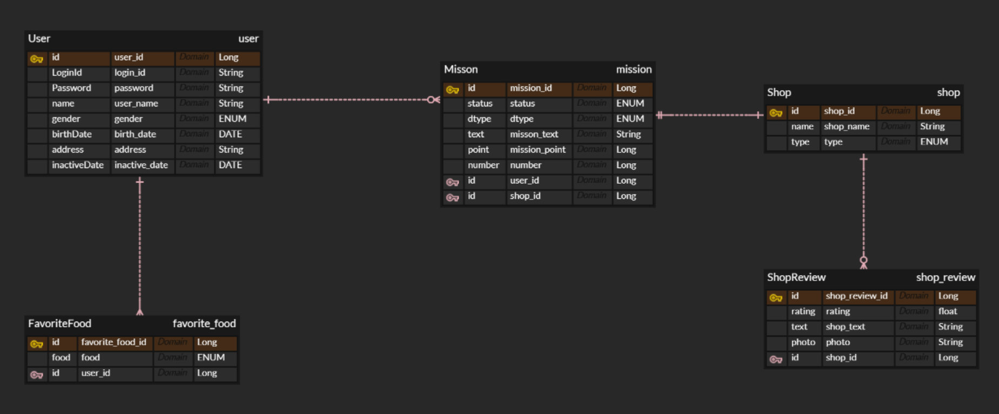

## DDL과 DML

### DDL
- Data Definition Language : 데이터 정의어
- 데이터베이스의 구조를 정의하거나 변경할 때 사용하는 명령어
- 테이블을 생성하거나(CREATE) 기존 테이블의 구조를 수정하는(ALTER) 등의 용도로 사용된다 
- ex) "학생"이라는 테이블을 생성, "전화번호"라는 칼럼을 추가

### DML
- Data Manipulation Language : 데이터 조작어
- 이미 만들어진 테이블에서 데이터를 넣고 바꾸고 지우고 조회하는 명령어
- SELECT, INSERT, UPDATE, DELETE 등등
- ex) 학생 테이블에 새 전화번호를 추가

 

## SQL와 NoSQL

### SQL
- Structured Query Language의 약자
- 관계형 데이터베이스를 사용하는 시스템에서 데이터를 관리하는 데 사용되는 언어
- 입출력의 속도 보다는 정확성, 일관성에 집중
- 구조화된 데이터에 강세

### NoSQL
- Not Only SQL의 약자
- SQL을 사용하지 않는 DBMS들
- key-value, document, graph 등 다양한 데이터 구조를 지원하기에 데이터가 미리 정의된 스키마를 따르지 않는다

### DBMS
- Database Management System
- 데이터를 효율적으로 저장하고 관리할 수 있도록 해주는 SW
- SQL을 사용하는 DBMS : MySQL, Oracle 등
- SQL을 사용하지 않는 DBMS : MongoDB, Redis 등
- 필요에 따라 적절한 DBMS을 선택할 것

 

## ERD 설계

### ERD
- 데이터베이스의 설계 결과물
- Entity Relationship Diagram (개체-관계 다이어그램)
- 데이터베이스에 들어갈 개체와 그들 사이의 관계를 시각적으로 표현한 설계도

### ERD가 보여주는 것
- Entity : 테이블이 될 대상 (학생, 강의, 주문 등)
- Attribute : 개체가 가진 정보 (이름, 학번, 가격 등)
- Relationship : 개체들 간의 연결 (예학생이 강의를 수강한다)

### ERD 설계 예제
#### 사용자 관련 요구 사항
1. **카카오 소셜 로그인**을 구현 할 예정이다.
2. **회원 탈퇴 기능**이 필요하다.
3. **이름, 닉네임, 전화번호, 성별**이 필요하다.

#### 책 관련 요구 사항
1. **사용자가 책 여러 권을 대여**할 수 있다.
2. 책은 **하나의 카테고리**가 있다.
3. 책은 **제목, 설명에 대한 정보**가 필요하다.
4. 책 소개 페이지에 **해시태그**가 붙을 수 있고,
   **책 한 권에 해시태그 여러 개**가, **해시태그 하나가 여러 책**에 붙을 수 있다.
5. 사용자가 책 설명 페이지에서 책에 **좋아요**를 누를 수 있다.
6. 책 **카테고리 별로 현재 몇 개의 책이 있는지 집계**가 필요하다.

#### 알림 관련 요구 사항
1. 알림은 **공지 관련 알림, 책 반납 시간 임박 알림, 마케팅 알림이 있을 수 있다.**

### ERD 설계 구상

#### 고려할 사항들
- 사용자와 책은 N : M 관계 (하나의 책이 여러 권 있을 수 있음)
- 카테고리와 책은 1 : N 관계
- 책과 해시태그는 N : M 관계
- 각 테이블 마다 생성 날짜와 업데이트 날짜를 위한 칼럼(created_at, updated_at) 필요하다고 함!
- 좋아요 수 집계 같은 기능의 경우 칼럼을 두는 것보다 SQL을 사용하는 것이 좋음

#### 사용자
- Id
- 카카오 계정 (카카오 소셜 로그인 구현용)
- 이름
- 닉네임
- 전화번호
- 성별 (0, 1로 표현 or enum으로 관리)
- inactive_date
  - 탈퇴 구현를 위한 칼럼
  - Soft Delete : 정해진 시간에 자동으로 실행되는 프로세스인 batch를 이용하여 일정 시간이 지난 후에 자동으로 삭제를 구현함
  - 삭제된 사용자의 댓글 정보 등을 보존하기 위해 사용되기도 한다

#### 책
- Id
- 제목
- 설명
- 카테고리 Id

#### 카테고리
- Id
- 카테고리 이름

#### 해시태그
- Id
- 해시태그 이름

#### 책_해시태그
- Id
- 책 Id
- 해시태그 Id

#### 사용자_책 (대여 책)
- Id
- 사용자 Id
- 책 Id

#### 좋아요
- Id
- 사용자 Id
- 책 Id

#### 알람
- 알람에는 세 가지 구현 방식이 존재함
1. 상위 수준의 알람 테이블을 두고 그 아래에 서브 테이블을 두는 것
2. 하나의 테이블을 두고 dtype으로 구분
3. 처음부터 여러 알람을 각자의 테이블로 두고 설계
- 여기서는 크게 정보 알람과 마케팅 알람으로 구분한 듯

 

## 정규화와 반 정규화

### 정규화
- 데이터를 분리해서 정리하는 것
- 테이블을 분리해 중복 데이터를 최소화하기 위해 사용된다
- 일반적으로 여러 단계로 나뉘며 정규형의 차수가 높아질수록 엄격한 규칙을 적용한다

#### 장점
- 중복 데이터가 없으므로 공간을 효율적으로 사용할 수 있다.
- 데이터의 일관성을 유지하기 쉽다
- 삽입/수정/삭제 시 발생하는 문제가 줄어든다

#### 단점
- 테이블이 여러 개로 나뉘며 구조가 복잡해진다
- 원하는 데이터를 얻기 위해 여러 테이블을 JOIN해야 하므로 성능이 저하될 수 있다

### 반 정규화
- 반 정규화는 정규화된 테이블의 성능 향상을 위해 의도적으로 데이터 중복을 허용하거나 테이블을 통합하는 것이다
- 정규화로 인해 발생하는 과도한 JOIN을 줄여 쿼리의 응답 속도를 높힌다
- 여러 연관관계 테이블을 하나로 합치거나 주문 총액/좋아요 개수 등 자주 사용되는 계산 결과를 칼럼에 추가한다
- 추가적인 저장 공간이 요구되고 데이터의 일관성을 유지하기 어렵다 (하나의 데이터를 수정할 때 관련된 모든 중복 데이터를 함께 수정해야 한다)

 

## DB에서의 상속 관계
DB에서의 상속 관계 표현은 아래의 세 가지 방법을 가장 대표적으로 사용한다
1. **상위 테이블 + 서브 테이블** : 상위 수준의 테이블을 두고 그 아래 해당 테이블을 상속받는 서브 테이블을 두는 것. 데이터의 무결성과 확장성이 높다
2. **하나의 테이블 + 타입 구분** : 하나의 테이블을 두고 dtype으로 구분. 해당하지 않는 속성들은 모두 Null 값으로 채워져 공간 낭비가 존재한다. JOIN 연산이 필요하지 않으므로 조회 성능이 높다
3. **개별 테이블** : 부모 클래스를 무시하고 상속 받는 자식 클래스마다 독립적인 테이블을 만든다. 공통 속성이 모든 테이블에 따로 존재해 유지 보수가 어렵다

 

## 인덱스
### 인덱스
- 데이터의 검색 속도를 높여주는 일종의 목차
- 데이터베이스 테이블의 데이터는 보통 순서 없이 저장된다. 그러나 필요한 칼럼에 해당하는 인덱스를 만들어 두면 간단한 검색 만으로 원하는 데이터를 바로 찾아낼 수 있다

### 예시
- 사용자 테이블에서 ‘이름’ 칼럼에 대한 인덱스를 만드는 경우
- 인덱스는 이름순으로 정렬되어 각 이름이 실제 데이터의 어디에 저장되어 있는지 주소값을 기록한다
- ‘홍길동’을 찾으라는 요청이 오면 정렬된 목차에서 홍길동을 빠르게 찾고 연결된 주소값을 이용해 실제 데이터를 찾아낸다

### 장단점
- 인덱스라는 별도의 데이터를 저장하게 되므로 추가 공간이 필요하다
- 데이터가 변경될 때마다 연결된 인덱스 목차도 함께 수정해야 하므로 쓰기 성능이 저하된다
- 쓰기 비용을 희생해 읽기 속도를 얻을 가치가 있는지를 잘 판단하고 결정할

 

## ✅ 미션
### 미션 내용

### 미션 기록 

- 설계 초반의 DB 구성. 설계 시 가독성을 높이기 위해 Java의 데이터 타입을 사용하여 설계하였다. 추후 결과물에서는 모든 데이터 타입을 DB에 맞는 데이터 타입으로 수정하였다.

- 여러 번의 수정을 거쳐 나온 미션 결과이다. 피그마의 UI를 참고해 회원 가입/홈 화면/미션을 위주로 DB 구조를 설계하였다.

- User의 경우 로그인 아이디와 패스워드, 닉네임, 성별 등의 기본적인 정보와 유저를 관리하기 위한 유저의 생성 날짜(created_at)와 비활성화 날짜(inactive_date)를 칼럼으로 만들었다. 이 중 gender의 경우 코드 내에서는 Enum 클래스로 관리된다.

- 유저가 선택하는 선호하는 음식 종류의 경우 FavoriteFood 테이블을 만들어 별도로 관리할 수 있게 하였다. User와 FavoriteFood는 1 : N 관계로 매핑되었다.

- Mission의 경우 dtpye을 이용해 미션의 종류와 상관없이 한 테이블 내에서 정보가 저장될 수 있도록 하였다. 10개의 미션 이후 추가적인 포인트를 얻는 추가 포인트 획득 역시 Mission 테이블에서 dtpye으로 분류된다.

- 유저의 총 포인트를 알고자 하는 경우 ‘유저 id로 해당 유저의 미션을 찾아 status가 완료로 표시된  미션’의 point만을 합산하면 된다. number는 해당 미션의 미션 인증 번호이다. finish_at의 경우 마이페이지에서 최신순으로 포인트 내역을 확인하기 위해 추가하였다.

- Shop과 ShopReview의 경우 Mission에서 사용되긴 하지만 독립적인 개체로 존재해야 하기에 별도의 테이블을 생성하였다. 그 중 photo의 경우 url을 받아오기 위해 데이터 타입을 varchar로 명시하였다.

- Shop과 FavoriteFood의 경우 생성과 삭제가 모두 관리자의 손에서 이루어지므로 생성 날짜를 표기하는 것이 의미가 없다고 생각해 created_at을 추가하지 않았다.

- 이외 updated_at 칼럼, Shop 테이블의 가게 설명과 위치 정보, 마이페이지 기능과 알람 기능의 구현의 생략하였다.