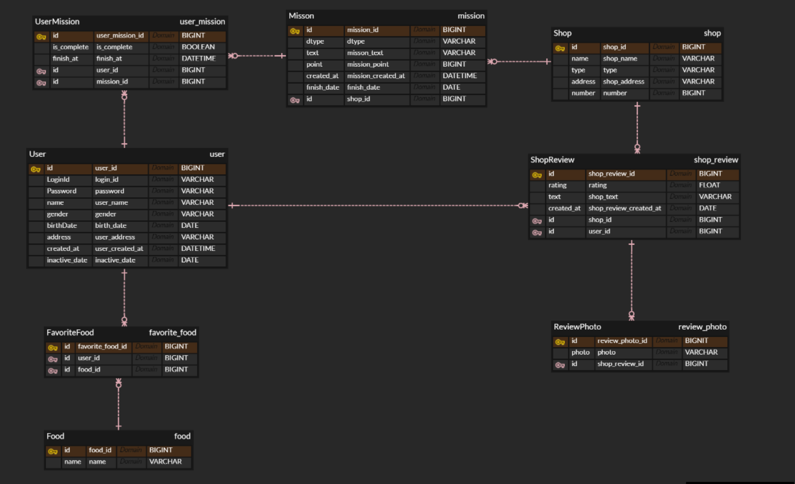

## join과 subquery

### join
- 관계형 데이터베이스에서 두 개 이상의 테이블을 특정 조건에 따라 공통된 정보(열)를 기준으로 합쳐서 하나의 결과 집합으로 보여주는 기능
- 두 테이블 사이에 연결고리가 될 공통된 컬럼이 필요. 보통 한 테이블의 기본 키와 다른 테이블의 외래 키를 사용하여 연결한다
1. INNER JOIN : 두 테이블에 공통적으로 존재하는 데이터만 합쳐서 새 테이블을 보여준다. 두 테이블 모두에서 조인 조건이 일치하는 행만 결과에 포함. 하나의 테이블에서라도 조건이 만족하지 않는 경우 해당 데이터를 표시하지 않는다
2. LEFT JOIN : 왼쪽 테이블의 모든 데이터를 포함하고 오른쪽 테이블은 조인 조건에 일치하는 데이터만을 가져온다. 만약 오른쪽 테이블에 일치하는 데이터가 없으면 그 부분은 NULL로 표시한다
3. RIGHT JOIN : 마찬가지로 오른쪽 테이블의 모든 데이터를 포함하고 왼쪽 테이블은 조인 조건에 맞는 데이터만을 가져온다
4. FULL OUTER JOIN : 두 테이블의 모든 데이터를 포함한다. 조인 조건에 일치하는 데이터는 합쳐서 보여주고 한쪽에만 존재하는 데이터는 다른 쪽을 NULL로 표시하여 결과에 포함시킨다. MySQL과 같이 해당 조인을 지원하지 않는 경우도 많다

### subquery
- 다른 SQL 쿼리문 안에 포함된 또 다른 SELECT 쿼리문 
- 서브쿼리는 괄호 ()로 감싸져 있으며 바깥쪽 메인 쿼리가 실행되기 전에 먼저 실행된다
- 서브쿼리의 실행 결과는 바깥쪽 메인 쿼리의 WHERE절, FROM절, SELECT절 등에서 조건 or 데이터로 활용된다

<br/>

## 트랜잭션
### 트랜잭션
- 트랜잭션은 성공 or 실패의 방식으로 처리되어야 하는 하나의 논리적인 작업 단위를 의미한다
- 여러 개의 SQL 명령문을 하나의 묶음처럼 처리하여 전부 성공하거나 전부 실패하는 것을 보장한다
- 이를 통해 데이터의 무결성과 일관성을 지킬 수 있다

### 트랜잭션의 특징
트랜잭션의 안정성은 ACID라는 4가지 핵심 특징으로 보장된다
1. 원자성 : 작업 묶음이 전부 성공하거나(COMMIT), 전부 실패하여야(ROLLBACK) 한다
2. 일관성 : 트랜잭션이 성공적으로 완료되면 데이터베이스는 항상 일관성 있는 상태를 유지하여야 한다. 예를 들어 계좌 이체 후에도 데이터베이스의 총액은 변하지 않아야 한다는 것을 예로 들 수 있다
3. 고립성 : 하나의 트랜잭션이 실행되는 동안에는 다른 트랜잭션이 끼어들어 데이터를 변경할 수 없다는 것을 의미한다. 여러 트랜잭션이 동시에 실행되더라도 트랜잭션은 서로를 알지 못하며 서로에게 영향을 주지 않고 순차적으로 실행된 것과 같은 결과를 보장한다
4. 지속성 : 성공적으로 완료된 트랜잭션의 결과는 시스템에 장애가 발생하더라도 영구적으로 기록되어야 한다. 즉 한 번 COMMIT된 내용은 사라지지 않는다

<br/>

## Join on과 where
### Join on
- ON 절은 테이블을 합칠 때 어떤 규칙으로 행과 행을 짝지을지 연결 조건을 명시하는 역할을 한다
- 논리적으로 테이블을 연결하는 단계에서 사용된다
```sql
SELECT *
FROM users
INNER JOIN posts ON users.id = posts.user_id;
```
위의 코드는 From 절에서 users 테이블과 posts 테이블을 합칠 때 users의 id와 posts의 user_id가 일치하는 항끼리 짝을 짓는 경우이다

### where
- where 절은 join을 통해 합쳐진 결과 집합 전체에서 어떤 행을 최종적으로 보여줄지 결정하는 필터링 조건이다
- 모든 테이블이 합쳐진 후에 적용된다
```sql
WHERE posts.status = 'published'
```
- 위의 쿼리문의 마지막 줄에서 해당 쿼리문을 추가적으로 작성하면 만들어진 결과에서 posts 테이블의 status가 'published'인 데이터만을 선택적으로 select할 수 있다

<br/>

## 0주차 미션 회고


### 유저 선호 음식
- 나의 경우 FavoriteFood 테이블을 만들어서 ENUM 타입의 문자열(food 변수)과 유저 id를 저장할 수 있도록 테이블을 구성했다
- 그러나 Food 테이블을 따로 만들어 Food 테이블 + FavoriteFood 테이블을 사용하는 방식이 훨씬 효율적
- 새로운 음식을 추가하고 싶을 때 Food 테이블에 새로운 행(INSERT)을 추가하기만 하면 된다 → DB 구조를 건드릴 필요 X
- 음식 목록을 조회하려 할 때 SELECT * FROM Food; 쿼리 한 번으로 쉽게 가져올 수 있다
- 만약 추후 추가적인 기능이 필요해진다면 Food 테이블에 category, image_url, description 등 다양한 정보를 기입할 수 있다

### 미션
- 미션의 경우도 '유저 미션'과 '미션'으로 나누는 편이 더 좋을 것 같다
- 현재는 미션 테이블에 완료 여부와 점수 등이 섞여 알아보기 힘들다
- 또한 **여러 유저가 같은 미션을 수행할 때** 유저마다 미션을 새로 만들어야 한다 
- 미션 테이블에는 미션 기한, 미션 조건, 성공 점수, 생성 일자 등의 미션에 관한 정보만을 채워넣는다
- 유저 미션 테이블에는 미션 id, 유저 id, 완료 여부를 두고 유저와 미션 사이의 정보들만을 관리한다

### 가게
- 가게와 미션 사이의 연결이 잘못되었다. **하나의 가게가 미션이 없을 수도 있고 여러 개의 미션을 열 수도 있다!**
- PM의 요청을 내가 오해한 부분 역시 존재했는데, 나는 가게 확인 번호가 미션마다 붙는 건 줄 알았는데 가게 확인 번호는 한 가게에 하나씩 존재하는 번호였다

### 리뷰 사진
- 하나의 리뷰에 여러 개의 사진이 들어갈 수 있다는 사실을 간과했다
- 리뷰 테이블과는 별개로 리뷰 사진 테이블을 만들어 하나의 리뷰에 여러 개의 사진이 들어갈 수 있도록 수정이 필요하다

### 수정 후의 결과


<br/>

## SQL
### 쿼리문 예시
아래의 쿼리문은 "안암동에 위치한 가게의 모든 미션 정보를 조회하고 싶다"는 요청에 의해 작성된 것이다
```sql
select * from mission
left join store on mission.store_id = store.store_id
left join location on store.location_id = location.location_id
where location.name = '안암동';
```
- 모든 mission 정보를 가져온다
- 각 미션에 store 테이블의 데이터들을 left join 한다
- 이때 연결 규칙은 ON 뒤에 작성되며 mission 테이블의 store_id와 store 테이블의 store_id가 같은 값을 연결한다
- 미션 테이블에 가게 데이터가 포함된다
- 만약 해당하는 가게 정보가 존재하지 않는다면 가게 정보 부분은 NULL로 푶기된다
- 이렇게 만들어진 결과에 location 테이블을 left join 한다
- location_id와 location 테이블의 location_id가 같은 값을 연결한다
- 불러온 미션 정보에 가게 데이터와 위치 데이터가 포함된다
- 해당 결과에서 location의 이름이 '안암동'인 모든 데이터(*)를 select한다

```sql
select * from (mission
left join store on mission.store_id = store.store_id
left join location on store.location_id = location.location_id)
where location.name = '안암동';
```
- 괄호를 통해 구조를 정확하게 하자면 위와 같다
- 해당 쿼리문의 과정은 크게 세 가지로 나뉜다
1. 테이블 합체 : 괄호 안의 쿼리문이 가장 먼저 실행된다. mission, store, location 테이블이 합쳐진 거대한 가상 테이블이 생성된다
2. 조건 필터링 : where 뒤의 조건이 해당 가상 테이블에 적용되어 조건에 맞는 행들을 남긴다
3. 최종 선택 : select * 구문이 필터링을 마친 결과 테이블에서 모든 열을 가져온다

### 서브쿼리와 join
아래의 쿼리문은 "별점이 3 이상인 리뷰 사진 URL들을 조회하고 싶다"는 요청에 의해 작성된 것이다

#### 서브쿼리 방식
```sql
select photo_url from review_photo as rp
where rp.review_id in (
select review_id from review as r
where r.star >= 3
);
```
- 서브쿼리의 경우 **안쪽 쿼리를 실행해 조건을 만들고 바깥쪽 쿼리에서 그 조건을 사용**하는 단계적 방식으로 동작한다
- 괄호 안의 서브쿼리 (select review_id...)가 가장 먼저 실행되어 review 테이블에서 별점이 3점 이상인 review_id 리스트를 생성한다
- 만들어진 목록은 바깥 쿼리의 조건이 된다
- review_photo 테이블에서 review_photo의 review_id가 만들어진 목록 안에 포함되어 있는지(IN)을 검사한다
- 검사가 끝난 review_photo 테이블에서 사진 URL 정보(photo_url)만을 select한다 

#### 조인 방식
```sql
select photo_url from review_photo as rp
left join review as r on rp.review_id = r.review_id
where review.star >= 3;
```
- review_photo 테이블에서 모든 데이터를 가져와 review과 left join한다
- 이때 연결 규칙은 review_photo 테이블의 review_id와 review 테이블의 review_id이 일치해야 한다
- 만들어진 결과에서 star가 3점 이상인 사진 URL 정보(photo_url)만을 select한다

#### 차이점
- 서브쿼리의 경우 join에 비해 가독성이 높다
- 그러나 join에 비해 성능이 매우 떨어진다는 단점이 존재한다
- 즉, 일반적으로는 서브쿼리보다 join을 사용하는 것이 권장된다!
- 그러나 복잡한 쿼리를 작성할 때에는 서브쿼리를 사용하는 것이 더 효율적인 경우 역시 존재한다
```sql
SELECT count(*) FROM book_like WHERE book_id = 3
and user_id not in (SELECT target_id FROM block WHERE owner_id = 2);
```
- 현재 사용자 아이디는 2번이고, 조회하려는 책의 아이디는 3번인 경우를 가정한다
- FROM book_like WHERE book_id = 3 : book_like 테이블에서 책의 아이디가 3번인 열을 가져온다
- (SELECT target_id FROM block WEHRE owner_id = 2) : 차단 목록을 관리하는 block 테이블에서 유저의 아이디가 2번인 target_id를 가져온다 (= 현재 유저가 차단한 사람들의 id만을 가져온다)
- and user_id not in (...) : 위에서 가져온 book_like 데이터에서 유저 id가 차단 id가 아닌 데이터만을 찾는다
- 찾아낸 데이터 전체(*)를 count한다
- NOT IN (또는 NOT EXISTS) 구문처럼 특정 조건을 만족하는 데이터를 '제외'하고 싶을 때 서브쿼리를 사용하면 로직을 매우 명확하고 효율으로 작성할 수 있다
- join만으로 해결하지 못하는 문제를 NOT IN, NOT EXISTS 등의 구문으로 쉽게 해결할 수 있다. 해당 구문은 서브쿼리를 이용해 조건을 만들어야만 사용할 수 있다

#### 복잡한 쿼리문 예시
"특정 미션 기한을 기준으로 제가 완료한 미션 점수의 총합을 조회하고 싶다"는 요청에 의해 작성된 쿼리문
```sql
select sum(point) from mission as m
left join user_mission as um on m.mission_id = um.mission_id
where um.is_complete = 1 and um.user_id = 1 and m.deadline >= '2025-09-08';
```
- mission 테이블에 user_mission을 left join
- 이때의 조건은 양 테이블의 mission_id가 동일할 것
- 결과로 만들어진 가상 테이블에서 이미 완료되었고 1번 유저가 수행하였으며 마감 기한이 2025-09-08 이후인 것만을 남긴다
- 조건을 통과한 모든 행의 미션 점수(point)를 sum한다

#### 문법 순서
DB가 쿼리를 처리하는 순서와 별개로 쿼리를 작성할 때는 아래의 작성 순서를 지켜야 한다
1. SELECT : 어떤 칼럼을 보여줄지를 결정
2. FROM : 데이터를 가져올 기본 테이블을 지정
3. JOIN (INNER, LEFT 등) : FROM 테이블에 연결할 다른 테이블을 지정
4. WHERE : 필터링 조건을 지정
5. GROUP BY : 그룹화. 여러 행을 특정 칼럼을 기준으로 묶어 데이터를 그룹화 → 이후 각 그룹에 대해 SUM(), COUNT() 등의 집계 합수를 사용한다
6. HAVING : 그룹화된 결과를 필터링할 조건을 지정
7. ORDER BY : 최종 결과를 어떤 순서로 정렬할지 결정
8. LIMIT: 최종 결과 중 보여줄 행의 개수를 제한
> 주의! WHERE과 HAVING을 구분할 것! <br/>
> WHERE : GROUP BY를 하기 전 **원본 테이블의 개별 행**을 필터링 <br/>
> HAVING : GROUP BY를 한 후 **집계된 그룹**을 필터링 <br/>

<br/>

## 페이징
### 페이징의 개념
- 조건에 맞는 데이터를 한 번에 가져오는 것은 말도 안 된다
- DB 자체에서 해당 데이터를 끊어서 가져오는 것이 필요 → 이를 페이징이라 한다
- 페이징에는 두 가지 페이징이 존재한다

### Offset based 페이징
페이지 번호를 직접 찾아내어 이동하는 페이징
```sql
select * from mission
order by mission_id desc
limit 10 offset 0;
```
limit을 통해 한 페이지에서 보여줄 데이터의 개수를 지정
offset으로 몇 개의 데이터를 "건너뛸지"를 정한다 → 시작하는 지점X 건너뛸 데이터의 개수를 지정하는 것
offset은 0부터 시작한다

```sql
select * from mission
order by mission_id desc
limit 15 offset 0;
```
- 미션 테이블의 모든 데이터를 가져온다
- 가져온 데이터들을 mission_id를 기준으로 desc(내림차순)으로 정렬한다
- 0개의 데이터를 건너뛰고 1번 위치부터 15개의 데이터를 가져온다
- 이후의 데이터는 limit 15 offset 15;를 이용해서 가져온다
- 이미 15개의 데이터를 가져왔으니 15개의 데이터를 건너뛰어야 한다!
- 즉, offset = (페이지 번호 - 1) x 페이지당 개수(limit)

#### 단점
- 그러나 offset paging에는 단점이 존재한다
- offset을 설정한다고 해서 데이터 베이스가 원하는 위치로 바로 이동하는 것은 불가능하다
- offset 10000을 수행하기 위해서는 1번부터 10000를 모두 읽어야 한다
- 즉, offset이 커질수록 읽기만 하고 결과에는 포함되지 않는 버리는 데이터가 많아진다
- offset의 크기가 성능을 좌우하게 되는 것이다
- 또한 새로운 데이터가 추가된 경우 offset이 꼬이는 치명적인 문제가 발생한다
- 해당 문제로 인해 데이터를 중복으로 보거나 혹은 특정 데이터를 보지 못하는 현상이 발생한다

### Cursor based 페이징
- 앞서 설명한 offset based 페이징의 단점을 보완한 페이징 기법이다
- 커서(=마지막으로 조회한 콘텐츠)를 사용해 페이징을 진행한다
```sql
select * from review
where review_id < ?     # 마지막으로 조회한 ID
order by review_id desc
limit 15;
```
- 위의 코드는 review_id를 내림차순으로 정렬해 15개 단위로 가져오는 코드이다
- 이때 where review_id < ? 해당 조건을 통해 가장 마지막으로 조회한 id보다 작은 id를 가진 데이터만을 조회할 수 있게 한다
- ?의 경우 클라이언트가 서버에게 마지막으로 본 페이지의 값을 전송하면, 서버가 ?의 값을 클라이언트가 보내온 값으로 채우게 된다

#### 문제
- 그러나 cursor based 페이징에도 문제가 존재한다
- 만약 별점이 3점 이하인 값을 페이징 하기 위해 페이징을 시도한다고 가정하자. 이때 별점이 3점인 리뷰가 50개이고 limit 10을 걸어 조회를 시도하게 되면 매번 같은 결과가 호출될 수밖에 없다
- 즉, 중복이 가능한 값을 사용했을 때 페이지가 넘어가지 않는 문제가 발생한다
- 이때는 중복될 수 없는 id를 커서해 추가해 문제를 해결할 수 있다!

#### 해결법
**기본 속성 + PK를 합친 문자열를 커서로 설정하여 조회하자**
- 절대 중복되지 않을 값을 보조 정렬 기준으로 사용하면 해당 문제를 해결할 수 있다
- 이때 보조 정렬 기준은 PK를 쓰는 것이 가장 좋다
```sql
SELECT r.*
FROM review AS r
WHERE (r.star, r.review_id) < (3, 52)
ORDER BY r.star DESC, r.review_id DESC 
LIMIT 15;
```
- 위의 코드는 **튜플 비교 방식**으로 짠 쿼리문이다
- 원본 데이터에 ORDER BY star DESC, review_id DESC 방식을 적용 → star에서 중복값이 발생한다면 review_id 순으로 다시 정렬한다
- star가 3 미만라면 review_id는 볼 필요도 없이 무조건 다음 페이지 대상이 됨
- 만약 star가 3이라면 그때는 review_id를 비교해서 52보다 낮은 id를 가진 리뷰만 다음 페이지 대상이 됨
- 만약 star가 3초과라면 페이지의 대상이 되지 않음
- 즉, 튜플을 사용함으로써 star=3이 될 때의 문제를 해결할 수 있다
```sql
select * from review as r
where r.star < ? or (r.star = ? and r.review_id < ?)
order by r.star desc, r.review_id desc
limit 15;
```
- 위에서 설명한 star가 3미만일 때, 3일 때, 3초과일 때의 세 가지 경우를 AND, OR 절로 만든 쿼리문으로 표현할 수도 있다!
- 그러나 사용하려는 BDMS가 튜플을 지원한다면 튜플 방식을 사용하는 것이 훨씬 간단하고 편리하다

<br/>

## ✅ 미션 기록
### 특정 가게에 달린 모든 리뷰 가져오기
```sql
SELECT *
FROM shop_review AS sr
INNER JOIN shop AS s ON sr.shop_id = s.id
INNER JOIN user AS u ON sr.user_id = u.id
LEFT JOIN review_photo AS rp ON sr.id = rp.review_id
WHERE sr.shop_id = ?;
```
- 가게 리뷰를 조회할 때 가게와 유저는 반드시 존재하여야 한다 → INNER JOIN 사용
- 이때의 조건은 가게 리뷰의 가게 아이디와 유저 아이디가 해당 테이블들의 PK와 일치하여야 한다
- 리뷰 사진은 있을 수도 있고 없을 수도 있으므로 LEFT JOIN을 사용한다. review_photo의 리뷰 id와 리뷰 테이블의 PK가 일치하여 한다
- 완성된 가상 테이블에서 WHERE문을 사용해 찾으려는 가게 id과 리뷰 테이블의 shop_id가 일치하는 데이터만을 select 한다
- ?의 자리에 프론트에서 받아온 가게 id를 삽입할 수 있다
- 필요하다면 SELECT의 뒤에 원하는 데이터만을 명시할 수 있다

<br/>

### 마이 페이지 정보 가져오기
```sql
SELECT u.user_name, u.gender, u.birth_date, u.user_address,
       SUM(m.point) AS total_point
FROM user AS u
LEFT JOIN user_mission AS um ON u.user_id = um.user_id
LEFT JOIN mission AS m ON um.mission_id = m.mission_id
WHERE u.user_id = ?
GROUP BY u.user_id, u.user_name, u.gender, u.birth_date, u.address;
```
- user 테이블 가져오기
- user 테이블에 user_mission 테이블을 LEFT JOIN
- 이때 유저 id가 일치하는 데이터들만 join 할 것
- 위의 결과 테이블에 mission 테이블을 LEFT JOIN
- 이때 미션 id가 일치하는 데이터들만 join 할 것
- 결과 테이블에서 프론트가 요청한 user_id를 가진 데이터만을 가져올 것
#### GROUP BY
- 이후 GROUP BY를 이용해 u.user_id를 기준으로 그룹을 묶어준다
- 만약 유저가 3번의 미션을 수행했다면 point외에 유저의 정보는 3번으로 중복되어 표현된다
- 그러나 GROUP BY를 사용하면 필터링된 3줄의 데이터를 단 하나의 그룹으로 묶어버린다
- 즉, 3줄의 데이터를 단 하나의 행으로 요약해 주는 것이다
#### GROUP BY 뒤에 user의 나머지 칼럼을 명시한 이유
- 엄격한 DB의 경우 SELECT 절에 작성되어 있지만 집계 함수로 묶이지 않은 모든 컬럼은 반드시 GROUP BY 절에 명시되어야 한다는 규칙이 존재한다
- 따라서 모든 칼럼을 GROUP BY에 적어주는 편이 호완성 높은 코드를 작성하기에 유리하다
#### 결론
- 이후 완성된 테이블에서 user의 기본 정보 칼럼들(name, gender, birth_date 등등)을 가져오며 SUM(m.point)를 사용해 합계 포인트를 가져온다
- 이때 AS를 사용해 만들어진 결과에 total_point라는 별칭을 붙여준다 → 사용이 편리해진다
- SUM(m.point) 대신 COALESCE(SUM(m.point), 0)을 사용하면 SUM(m.point)이 NULL값일 때 0을 반환하도록 쿼리를 수정할 수 있다
#### Q. 쿼리문을 한 번에 작성하는 이유
- 유저의 정보 가져오기, 해당 유저의 포인트 계산하기 이렇게 두 개의 정보를 원하는 경우에도 한 페이지의 내용은 한 번의 쿼리로 작성되는 것이 좋다
- 두 번에 나눠 쿼리를 작성할 경우 DB에 두 번의 요청이 가게 되므로 비효율적이다
- 또한 두 쿼리의 실행 사이 데이터가 변경될 가능성이 있다

<br/>

### 미션 모아보기
#### 페이징 전의 코드
```sql
SELECT um.is_complete, um.finish_at, m.dtype, 
       m.mission_text, m.mission_point, m.finish_date, s.shop_name
FROM user_mission AS um
INNER JOIN mission AS m ON um.mission_id = m.mission_id
INNER JOIN shop AS s ON m.shop_id = s.shop_id
WHERE um.user_id = ?
ORDER BY m.finish_date DESC
```
- user_mission에 mission 테이블을 join 한다
- 이때 미션 id가 같은 데이터들만이 join 된다
- 결과 테이블에 shop 테이블을 join 한다 (가게 이름을 가져와야 함)
- 이후 결과 테이블에서 프론트가 요청한 user_id를 가진 데이터만을 가져온다
- 가져온 데이터들을 마감 시간을 기준으로 정렬한다

#### 페이징 후의 코드
```sql
SELECT um.is_complete, um.finish_at, m.dtype, m.mission_text,
       m.mission_point, m.finish_date, s.shop_name
FROM user_mission AS um
INNER JOIN mission AS m ON um.mission_id = m.mission_id
INNER JOIN shop AS s ON m.shop_id = s.shop_id
WHERE um.user_id = ? AND (m.finish_date, um.user_mission_id) < (?, ?)
ORDER BY m.finish_date DESC, um.user_mission_id DESC
LIMIT 10;
```
- 페이징을 위해 마감 기한과 유저 미션 id를 튜플 조건으로 사용하였다
- 페이징 중 마감 기한이 같은 값을 만날 경우 user_mission_id를 통해 순서를 구분한다
- 커서 조건 (m.finish_date, um.user_mission_id) < (?, ?)의 경우 첫 번째 페이지를 조회할 때는 사용되지 않도록 별도의 조치가 필요하다

<br/>

### 홈 화면 
#### 현재 선택 된 지역에서 도전이 가능한 미션 목록 보여주기
```sql
SELECT m.dtype, m.mission_text, m.mission_point, m.finish_date, s.shop_name
FROM mission AS m
INNER JOIN shop AS s ON m.shop_id = s.shop_id
WHERE s.shop_address like ?
      AND m.finish_date >= NOW()
      AND (m.finish_date, m.mission_id) < (?, ?)
ORDER BY m.finish_date DESC, m.mission_id DESC
LIMIT 10;
```
- 미션 테이블과 shop 테이블을 shop_id를 기준으로 join
- 유저가 선택한 주소와 유사한 주소를 가지고 마감 기한이 지나지 않은 미션의 데이터들만을 반환
- 어플리케이션에서 데이터를 받아올 때 ? 자리에 들어갈 문자열 앞 뒤로 %를 붙여줄 것
- 페이징 구현
